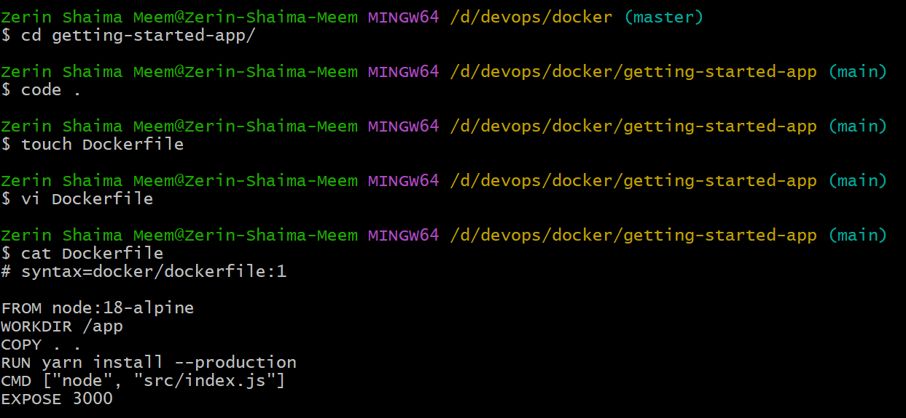
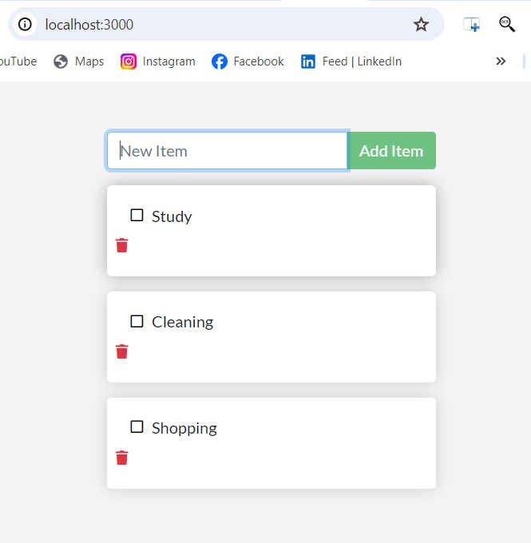

# DevOps_Course
## Docker Projects:
### Project1: Follow the command
1. Clone this repository
a. https://github.com/docker/getting-started-app
2. Use following base image
a. node:18-alpine
3. Use following directory as workdir
a. WORKDIR /app
4. Run following command to install the application
a. yarn install --production
5. Use following as CMD
a. CMD ["node", "src/index.js"]
6. This server runs at 3000 port.
### Work:

  <h4>Dockefile -> build -> run</h4>
  
  
  
  <h4>Website (To-Do-List)</h4>
  

### Project2: DIY
1. Clone this repository
a. https://github.com/cloudacademy/static-website-example
2. Write Dockerfile to host this
Hint: use apache server and copy the whole directory into /var/www/html
### Work:

  <h4>Dockefile -> build -> run</h4>
  
  
  <h4>Website</h4>
  

### Project3: Follow the Dockerfile (Python)
1. Clone this repository
a. https://github.com/ngallot/docker-python-helloworld
2. Here you find a dockerfile, try to understand how to run a python application using
docker
3. Run the application using docker

Bonus: Run this application using your own Dockerfile
https://github.com/digitalocean/sample-python
### Work:
<h3>Python Project 1</h3>

  <h4>Dockefile -> build -> run</h4>
  

<h3>Python Project 2</h3>

  <h4>Dockefile -> build -> run</h4>
  
  <h4>Website</h4>
  

### Project4: Follow the Dockerfile (PHP)
1. Clone this repository
a. https://github.com/fuhrysteve/php-docker-apache-example
2. Here you find a dockerfile, try to understand how to run a php application using docker
3. Run the application using docker
Now try to run the following repo by writing your own Dockerfile
https://github.com/banago/simple-php-website
### Work:

  <h4>Dockefile -> build -> run -> View in Port 8080</h4>
  

